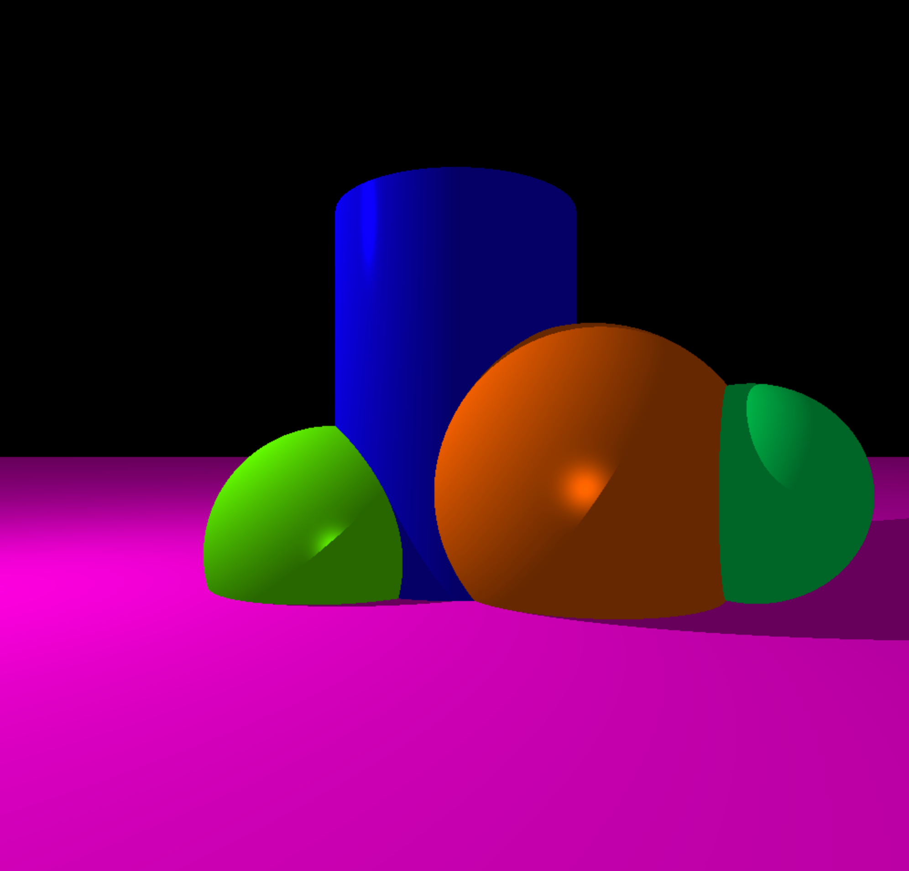
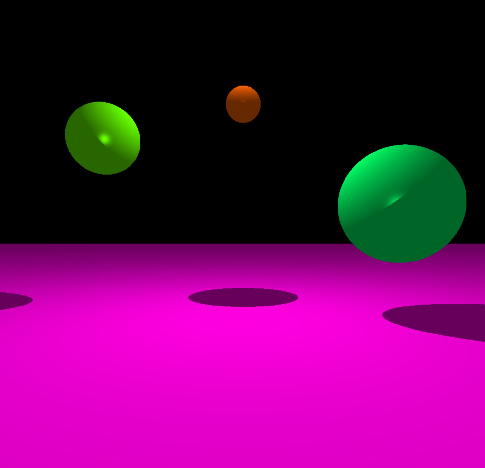

 

  

  <h3 align="center">MiniRT</h3>

  

    Ray Traced 3D Engine Written in C
     
     
    <a href="https://github.com/karamon17/">Gevorg</a>
    |
    <a href="https://github.com/VladimirBudilov">Vladimir</a>
  

# About
miniRT is a 3D rendering engine based on the ray tracing algorithm. This project has a big focus on interactivity, you can move, rotate, and scale shapes in real-time.

## Gallery

# Features

* Rendering of 3D shapes like spheres, cylinders and planes
* Set shape properties like height, radius, position, and orientation before rendering
* Set camera position and orientation before rendering
* Set point light position, color, and intensity before rendering
* Phong model of lighting using ambient, diffuse, and specular components
* Shadows
* Edit mode: Edit shape properties like position, orientation, scale, and color in real-time
* Camera mode: Move camera around the scene

## Controls

`mouse click` select different shapes

`WASD` or to translate shapes

`z, c, r, f` to rotate shapes/lights

`spase` to select shapes/lights

`q, r` to manipulate shapes

`Arrow Keys` to translate the camera

`+, -` to manipulate the camera

`1, 2, 3, 5` to rotate camera
